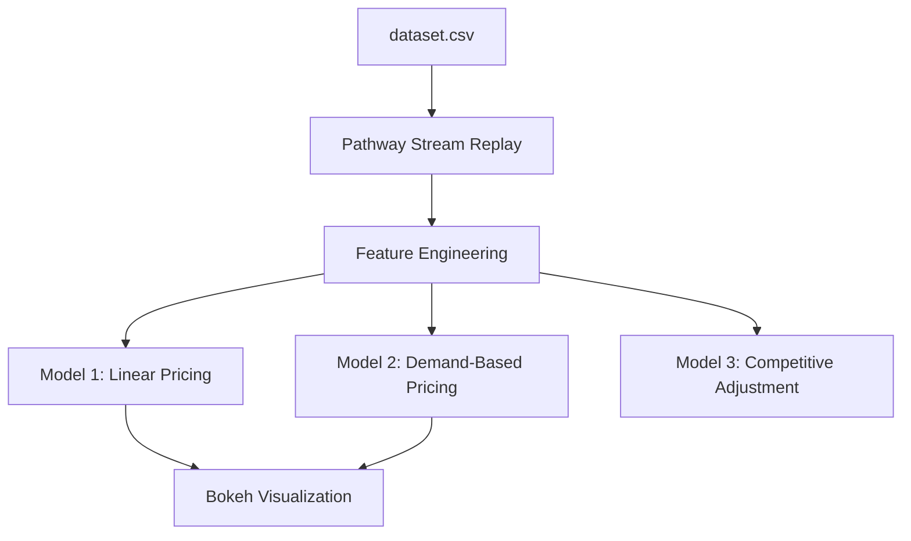

# Dynamic Pricing for Urban Parking Lots

Capstone Project – Summer Analytics 2025  
Hosted by Consulting & Analytics Club × Pathway  
Author: Aarabhi Manoj  

---

## Project Overview

The project aims to simulate real-time dynamic pricing for urban parking spaces based on live occupancy, traffic conditions, vehicle types, and competitive influence from nearby parking lots. Leveraging the power of Pathway's streaming framework, we ingest time-sensitive parking data and compute pricing using three progressively advanced models.

---

## Tech Stack

- Python (core language)
- Pandas & Numpy (feature engineering and math)
- Pathway (real-time stream ingestion and transformation)
- Bokeh & Panel (live plotting and web visualization)
- Google Colab (development and testing environment)

---

## Architecture Diagram


---
## Model 1: Baseline Linear Pricing Model
**Objective:**
This is a simple pricing model where the price changes linearly with the occupancy of the parking lot.

**How it works:**
- We use the occupancy data and capacity for each parking lot, streamed in real-time using Pathway.
- The price for each lot is calculated as:
```Price = BasePrice + 𝛼 × (Occupancy / Capacity)```
​
where BasePrice = 10 and α is a scaling factor (2 in our implementation).
This ensures the price increases as demand (occupancy) increases, giving a simple but effective dynamic pricing signal.

**Implementation Notes:**
- Used Pathway's streaming API to simulate real-time data ingestion.
- Applied a daily tumbling window aggregation for computing average occupancy and capacity per parking lot.
- Plotted the prices over time for each parking lot using Bokeh to visualize how prices fluctuate with demand.

**Sample Plot**


---

## Model 2: Demand-Based Pricing Model
**Objective:**
To incorporate more factors affecting demand beyond just occupancy, such as queue length, traffic conditions, special days, and vehicle types, for a refined pricing strategy.

**How it works:**
The price depends on a composite demand function formulated as:


- Parameters (𝛼, 𝛽, 𝛾, 𝛿, 𝜖) are weights tuned based on assumed influence.
- The raw demand is normalized with a sigmoid-like function to avoid extreme prices and maintain smooth pricing behavior.
- Final price is clipped within a reasonable range (0.5 to 2 times the base price).

**Implementation Notes:**
- Added additional features into the streaming dataset (queue length, traffic conditions, etc.).
- Aggregated features daily per lot with Pathway windows.
- Applied the demand formula and price clipping logic in Pathway.
- Visualized model price dynamics with Bokeh.

**Sample plot:**


---
## Visual Comparison: Model 1 vs Model 2
**Objective:**
Compare baseline linear pricing with demand-based pricing side by side.

**How it works:**
- Joined price streams from Model 1 and Model 2 based on timestamp and lot ID.
- Plotted prices together to highlight how incorporating demand features affects pricing.

**Sample plot:**


---

## Model 3: Competitive Pricing Adjustment
**Objective:**
To adjust prices dynamically by considering competitor prices within a radius of 0.5 km for each parking lot.

**How it works:**
- Computed nearby competitors for each parking lot using the Haversine formula and KDTree for efficient spatial queries.
- Compared own price from Model 2 with average competitor prices.
- If competitors price lower → reduce own price slightly to stay competitive.
- If competitors price higher → increase own price slightly.
- This maintains competitive positioning and market-driven pricing.

**Implementation Notes:**
- Precomputed competitor mapping based on geographic proximity.
- Used Pathway's pw.apply() to adjust Model 2 prices based on competitor prices.
- Visualized adjusted final prices with Bokeh.

