# Dynamic Pricing for Urban Parking Lots

Capstone Project – Summer Analytics 2025  
Hosted by Consulting & Analytics Club × Pathway  
Author: Aarabhi Manoj  

---

## Project Overview

The project aims to simulate real-time dynamic pricing for urban parking spaces based on live occupancy, traffic conditions, vehicle types, and competitive influence from nearby parking lots. Leveraging the power of Pathway's streaming framework, we ingest time-sensitive parking data and compute pricing using three progressively advanced models.

---

## Tech Stack

- **Python** (core programming language for data processing and modeling)
- **Pandas & NumPy** (data cleaning, feature engineering, and mathematical computations)
- **Pathway** (real-time streaming data ingestion, transformation, and windowed aggregation)
- **Bokeh & Panel** (interactive, live plotting and web visualization dashboards)
- **Google Colab** (cloud-based notebook environment for development and collaboration)
- **Scipy KDTree** (efficient spatial indexing for geographic competitor queries)
- **Haversine formula** (calculating accurate distances between latitude-longitude coordinates)
- **Git & GitHub** (version control and collaborative source code management)

---

## Architecture Diagram

```mermaid
graph TD
  A[Raw Dataset → dataset.csv] --> B[Pathway Stream Replay]
  B --> C[Feature Engineering]
  C --> D[Occupancy, Demand Score, Competitor Mapping]
  D --> E1[Model 1: Linear Pricing]
  D --> E2[Model 2: Demand-Based Pricing]
  D --> E3[Model 3: Competitive Adjustment]
  E1 --> F[Bokeh Visualization]
  E2 --> F
  E3 --> F
  F --> G[Dashboard / Reports] 
```



---
## Model 1: Baseline Linear Pricing Model
**Objective:**

This is a simple pricing model where the price changes linearly with the occupancy of the parking lot.

**How it works:**
- We use the occupancy data and capacity for each parking lot, streamed in real-time using Pathway.
- The price for each lot is calculated as:

```Price = BasePrice + 𝛼 × (Occupancy / Capacity)```
​

where:

- BasePrice = 10
- α is a scaling factor (2 in our implementation).

This ensures the price increases as demand (occupancy) increases, giving a simple but effective dynamic pricing signal.

**Implementation Notes:**
- Used Pathway's streaming API to simulate real-time data ingestion.
- Applied a daily tumbling window aggregation for computing average occupancy and capacity per parking lot.
- Plotted the prices over time for each parking lot using Bokeh to visualize how prices fluctuate with demand.

**Sample Plot:**


---

## Model 2: Demand-Based Pricing Model
**Objective:**

To incorporate more factors affecting demand beyond just occupancy, such as queue length, traffic conditions, special days, and vehicle types, for a refined pricing strategy. A composite demand score is calculated using a weighted sum of key features.

**How it works:**

Let:

```OccupancyRate = Occupancy / Capacity```

The price depends on a composite demand function formulated as:

```Demand = α × OccupancyRate + β × QueueLength - γ × Traffic + δ × IsSpecialDay + ε × VehicleTypeWeight```

where:
- Parameters (𝛼, 𝛽, 𝛾, 𝛿, 𝜖) are weights tuned based on assumed influence.
- The raw demand is normalized with a sigmoid-like function to avoid extreme prices and maintain smooth pricing behavior.
  
Then the real-time price is calculated as:

```Price_t = BasePrice × (1 + λ × NormalizedDemand)```

Finally, to avoid erratic price fluctuations, the price is bounded:
```
if Price_t < 0.5 × BasePrice:
    Price_t = 0.5 × BasePrice
elif Price_t > 2 × BasePrice:
    Price_t = 2 × BasePrice
```

Final price is clipped within a reasonable range (0.5 to 2 times the base price).

**Implementation Notes:**
- Added additional features into the streaming dataset (queue length, traffic conditions, etc.).
- Aggregated features daily per lot with Pathway windows.
- Applied the demand formula and price clipping logic in Pathway.
- Visualized model price dynamics with Bokeh.

**Sample plot:**


---
## Visual Comparison: Model 1 vs Model 2
**Objective:**

Compare baseline linear pricing with demand-based pricing side by side.

**How it works:**
- Joined price streams from Model 1 and Model 2 based on timestamp and lot ID.
- Plotted prices together to highlight how incorporating demand features affects pricing.

**Sample plot:**


---

## Model 3: Competitive Pricing Adjustment
**Objective:**

To adjust prices dynamically by considering competitor prices within a radius of 0.5 km for each parking lot.

**How it works:**  
- For each parking lot, we identify nearby competitors within 0.5 km using the Haversine distance formula combined with a KDTree spatial index for efficient lookup.
- We start with the demand-based price from Model 2 as the base price.
- Then, we compare the base price with the average competitor prices in the vicinity.
- The final price is adjusted by a small delta (∆) based on the comparison:
  
`Final Price = Price_Model2 + Δ`

where

```
Δ = {
    -0.5  if avg_competitor_price < own_price
    +0.3  if avg_competitor_price > own_price
    0     otherwise
}
```

**Implementation Notes:**
- Precomputed competitor mapping based on geographic proximity.
- Used Pathway's pw.apply() to adjust Model 2 prices based on competitor prices.
- Visualized adjusted final prices with Bokeh.

**Sample plot:**


---

## Merged Model Comparison: Pricing Behavior Across Models

**Objective:**  

To provide a unified visualization comparing pricing from all three models on the same plot, enabling direct comparison of their pricing dynamics over time.

**How it works:**  

- Prices from Model 1, Model 2, and Model 3 are joined based on timestamps and parking lot IDs.
- Each model’s prices are plotted as separate lines with distinct colors.
- The visualization highlights differences in pricing strategies and how competitive adjustments affect final prices.

**Pricing Behavior Explanation:**

- **Model 1** produces the baseline prices, generally the lowest, as it only considers occupancy linearly.
- **Model 2** increases prices more aggressively by incorporating multiple demand factors, resulting in higher price peaks.
- **Model 3** adjusts Model 2 prices considering competitor pricing, nudging prices slightly up or down to stay competitive, typically positioning Model 3 prices between Models 1 and 2.

This combined view allows stakeholders to understand the impact of each model's complexity on price optimization.

**Sample plot:**


---

## Limitations & Future Work

- The models assume static parameter tuning and simplified demand factors.
- Real-world competitor prices can be more volatile; live integration is needed.
- More granular temporal windows (e.g., hourly) could improve responsiveness.
- Additional features like weather, events, or historical trends could be incorporated.
- A user-facing dashboard with filtering options would improve usability.

---

## Conclusion

This project demonstrates a progressive approach to real-time dynamic pricing for urban parking using streaming data and behavioral economics principles. The three models showcase increasing sophistication, from linear pricing to demand-aware and finally competitor-aware pricing. Visualization using Bokeh provides intuitive insights into pricing dynamics, paving the way for smarter urban mobility solutions.

---

